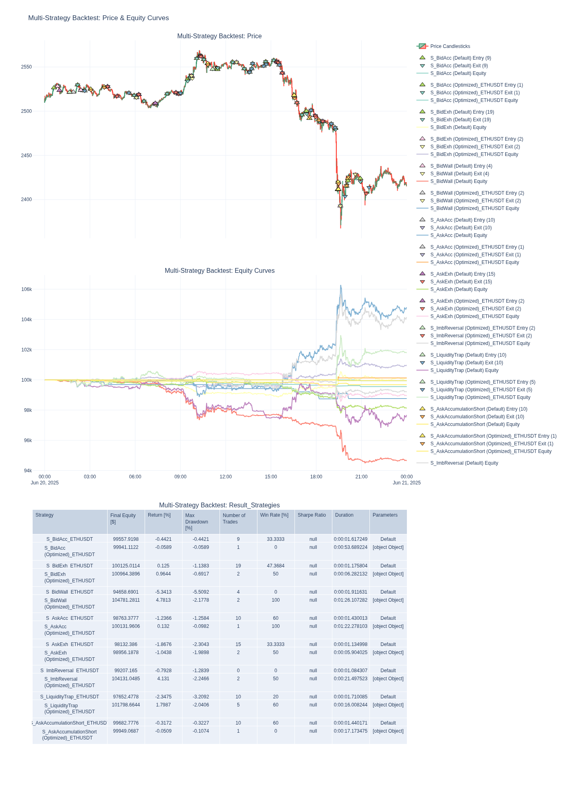

# Analytic-Trading Service
-----

# Analytic-Trading Service

## Наименование проекта: Сервис проверки стратегий, получения сигналов и торговли (Analytic-Trading Service)

-----

## Описание Проекта

Проект **Analytic-Trading Service** исследует и реализует возможности построения эффективных торговых стратегий на основе анализа **дельты ордербука** с биржи Bybit Testnet. Основная задача — разработать систему, способную собирать, анализировать данные ордербука и Klines, вычислять метрики дельты, строить и симулировать стратегии, а также генерировать торговые сигналы для реальной торговли.

**Ключевые цели тестового задания:**

1.  **Сбор данных:** Реализация механизмов сбора данных ордербука (Level 2) и OHLCV (Klines) с Bybit Testnet (REST API и WebSocket).
2.  **Вычисление метрик:** Разработка логики для расчета метрики дельты ордербука и связанных с ней показателей.
3.  **Построение стратегии:** Создание простых торговых стратегий, основанных на метриках дельты.
4.  **Симуляция и бэктест:** Проведение исторического тестирования (бэктестинга) и симуляции работы стратегий.
5.  **Отчетность:** Подготовка подробных отчетов о производительности стратегий.

-----

## Структура Проекта

Проект разработан в соответствии с принципами чистой архитектуры, разделенной на слои:

  * **`domain` (Business Logic Core):** Независимая часть проекта, его ядро. Содержит ключевую бизнес-логику, такую как расчеты дельты, определение торговых сигналов и сами стратегии.
  * **`application` (Use Cases):** Оркестрирующий слой, обеспечивающий взаимодействие между доменным слоем и инфраструктурой. Здесь реализуются конкретные сценарии использования и потоки данных. Применяется **паттерн CQRS** (Command Query Responsibility Segregation) для разделения логики чтения и записи.
  * **`infrastructure` (Adapters):** Слой инфраструктуры, отвечающий за взаимодействие с внешними системами, такими как биржа Bybit (через API и WebSocket), системы хранения данных (ClickHouse), а также за загрузку архивных данных.

**Пример структуры каталогов:**

```
.
├── pyproject.toml
├── README.MD
├── SCHEMA_MODES_FLOW.jpg (схема режимов и потоков сервиса)
├── datasets/
├── reports/
└── src/
    ├── test/
    │   ├── unit/
    │   └── integration/
    ├── application/
    │   ├── commands/
    │   ├── handlers/
    │   ├── services/
    │   └── ...
    ├── domain/
    │   ├── events/
    │   ├── strategies/
    │   └── utilits/
    │   └── ...
    └── infrastructure/
        ├── adapters/
        ├── config/
        ├── logging_config.py
        └── storage/
            ├── repositories/
            └── schemas.py
```


## Режимы Работы Сервиса

Сервис может работать в различных режимах, обеспечивая гибкость для анализа и торговли. Выбор режима определяется флагами в `src/main.py`. Возможно одновременное включение нескольких режимов.

### 0\. Инициализация Хранилища (`initialisation_storage`)

Перед запуском любого режима происходит инициализация базы данных ClickHouse.

  * Подключается к базе данных `default`, создает необходимую базу (`settings.clickhouse.db_name`).
  * Создает все необходимые таблицы на основе Pydantic схем (`OrderbookSnapshotModel`, `KlineRecord`, `TradeResult` и др.), если они еще не существуют.
  * Позволяет использовать **тестовую сеть Bybit** (`TEST_NET` флаг) для инициализации с тестовыми параметрами базы данных и API.

### 1\. `ARCHIVE_MODE` (Работа с архивными данными)

(`ARCHIVE_MODE = True` в `main.py`)
Этот режим предназначен для первоначального сбора и обработки исторических данных.

  * **Парсинг исторических свечей (Klines):** Использует `KlineParser` для загрузки исторических данных OHLCV за указанный период (`settings.start_time`, `settings.end_time`) и сохраняет их в `kline_archive`.
  * **Обработка ZIP-архивов ордербуков:** `ArchiveProcessor` обрабатывает локальные ZIP-архивы ордербуков из папки `datasets` (`settings.datasets_dir`), анализирует их и сохраняет снимки в `orderbook_archive_snapshots`, а также отмечает обработанные файлы в `orderbook_archive_filename`.
    

### 2\. `BACKTEST_MODE` (Тестирование стратегий)

(`BACKTEST_MODE = True` в `main.py`)
Этот режим предназначен для симуляции и оптимизации торговых стратегий на основе исторических данных.

  * **Источники данных для бэктеста:**
      * **`ARCHIVE_SOURCE = True`**: Бэктест использует данные, собранные в `ARCHIVE_MODE` (из ZIP-архивов и исторических Klines).
      * **`STREAM_SOURCE = True`**: Бэктест использует данные, которые были предварительно собраны и сохранены в базу данных в рамках `STREAM_MODE`.
      * Возможно одновременное использование `ARCHIVE_SOURCE` и `STREAM_SOURCE` для комплексной оценки.
  * **Обновление параметров стратегий:** `BacktestRunner` не только симулирует стратегии, но и включает логику для нахождения и сохранения лучших параметров стратегий, которые могут быть использованы в дальнейшем в `STREAM_MODE` (например, для живой торговли).

    

### 3\. `STREAM_MODE` (Работа со стриминговыми данными и торговлей)

(`STREAM_MODE = True` в `main.py`)
Основной режим для работы в реальном времени, сбора данных, получения торговых сигналов и, при необходимости, выполнения торговых операций.

  * **Выбор протокола:**

      * **`USE_WS = True`**: Используется **WebSocket** для высокочастотного получения данных ордербука и Klines. Это предпочтительный выбор для постоянного и надежного сбора данных из-за низкой задержки и эффективности.
      * **`USE_WS = False`**: Используется **REST API** для периодического получения данных.

  * **Потоковая обработка данных:**

      * `KlineDataCollector` и `OrderbookDataCollector` непрерывно собирают данные с биржи.
      * `EventPublisher` распространяет события о получении данных.
      * `DataPipelineService` обрабатывает эти события, передавая данные для анализа (`StreamStrategyProcessor`) и возможной генерации торговых сигналов (`TradingProcessor`).

  * **Длительность работы:** Режим может работать либо в течение заданного `settings.streaming.duration` (в секундах), либо бессрочно.

#### `TRADE_MODE` (Встроенный в `STREAM_MODE`)

В этом режиме происходит полный цикл работы с живыми данными:

1.  **Получение данных**: Сбор данных в зависимости от выбранного интерфейса (REST API/WebSocket).
2.  **Обработка данных**: Анализ данных, расчет параметров и дельт, сохранение их в базу данных.
3.  **Использование стратегий**: Данные передаются в модуль оценки стратегиями, где генерируются торговые сигналы.
4.  **Трейдинг**: Полученные сигналы используются для выполнения торговых операций (инициирования сделок).

### Автоматическая Оптимизация Параметров

Предусмотрена функциональность **автообновления лучших параметров для стратегий** на основе результатов аналитики бэктестинга. Это позволяет системе адаптироваться к изменяющимся рыночным условиям.

-----

## Отчетность и Визуализация

Проект включает в себя инструменты для генерации отчетов и визуализации результатов:

  * **Отчеты по производительности:** Автоматически генерируются HTML-дашборды и CSV-файлы, содержащие ключевые метрики и графики.
      * Пример отчета (HTML): [./reports/1751971174/output-single\_large\_dashboard-20250708-124439.html](./reports/1751971174/output-single_large_dashboard-20250708-124439.html)
      

      * Пример данных (CSV): [./reports/report/1751971174/strategy_performance_ETHUSDT_2025-06-20_2025-06-21.csv](./reports/1751971174/strategy_performance_ETHUSDT_2025-06-20_2025-06-21.csv)
      
  * **Схема сервиса:** Визуальное представление архитектуры и потока данных:
      * 

-----

## Установка и Запуск

Для запуска проекта выполните следующие шаги:

### 1\. Подготовка виртуального окружения

```bash
python -m venv venv
source venv/bin/activate
```

### 2\. Установка зависимостей

```bash
pip install -e .
# Если зависимости не установились, попробуйте принудительную установку:
pip install --upgrade .
```

### 3\. Настройка переменных окружения

Создайте файл `.env` в корневой директории проекта и заполните его необходимыми данными для подключения к Bybit и ClickHouse.

```bash
touch .env
```

Пример содержимого файла `.env` (копия из `.env.example`):

```
#.env

# General settings
LOGGER_LEVEL=DEBUG
...
```

### 4\. Запуск приложения

```bash
python -m src.main
```

### 5\. Тестирование приложения

```bash
pytest src/  -v 
```

-----

## Ход Работы над Проектом

Процесс разработки был итеративным и включал следующие этапы:

### Инициализация Проекта

  * **Настройка окружения:** Создание `venv` и установка базовых зависимостей.
  * **Структура папок:** Формирование структуры `src/{application,domain,infrastructure/adapters}` и `tests/{application,domain,infrastructure/adapters}`.
  * **Управление зависимостями:** Фиксация версий библиотек (`pyproject.toml`), добавление `dotenv`, `pytest`, `bybit-api` и `aiohttp`.

### Проектирование

  * **PEP 518 и `pyproject.toml`:** Изучение и настройка стандартного способа управления проектом Python.
  * **Слоистая архитектура:** Пример применение принципов `domain`, `application`, `infrastructure`.
  * **Паттерн CQRS:** Разделение логики команд (записи) и запросов (чтения) для лучшей масштабируемости и управляемости. В `src/application/contracts.py` добавлен обработчик `Query` в `EmptyHandler`.

### Стратегии Дельты

  * **Анализ дельты:** Идея расчета и анализа дельт на различных тиках, построение тепловых карт для выявления всплесков и их причин. Поиск узлов ликвидности и оценка "надежности" распределения объемов.
  * **Построение комплексной стратегии:** Объединение анализа дельт со вспомогательными инструментами для генерации торговых сигналов.

### Принцип Работы Модулей

1.  **Модуль Архивных Данных:**
      * **Сбор:** Использование архивных данных Bybit (ZIP-архивы) для ордербуков и получение OHLCV (Klines) через REST API Binance (или другой источник, если необходимо).
      * **Парсинг:** Разработка парсеров для преобразования сырых данных в плоскую структуру и их сохранения в ClickHouse.
2.  **Модуль Стриминговых Данных:**
      * **Collector:** Получение снимков ордербука (и Klines) в реальном времени (HTTP / WebSocket) и сохранение их в `orderbook_snapshots` и `kline_archive`.
      * **DeltaAnalyzer:** Анализ полученных данных, вычисление метрик дельты (`total_delta`, `delta_by_level` и т.д.) с использованием `DeltaCalculator` и сохранение результатов в `orderbook_deltas`.
3.  **Модуль Торговой Стратегии (`TradingStrategy`):**
      * Реализация торговой стратегии на основе анализа дельты ордербука.
      * Фиксация результатов торговли в таблице `trade_results`.
4.  **Модуль Симуляции / Бэктеста (`BacktestSimulator`):**
      * Симуляция работы стратегий на исторических или потоковых данных.
      * Фиксация результатов симуляции для оценки производительности.
5.  **Модуль Генерации Отчетов (`ReportGenerator`):**
      * Генерация визуальных отчетов и сводных данных по результатам бэктестинга и торговли.

**Ключевой принцип:** **Модульность** проекта, разделение по слоям и этапам с фиксацией результатов в БД на каждом этапе для масштабирования, контроля нагрузки и гибкости.

### Детали реализации и рефакторинга

  * **Репозитории (`src/infrastructure/storage`):** Созданы варианты репозиториев (SQLite и ClickHouse) на основе абстрактного класса `BaseRepository` для гибкости. Использование Pydantic для валидации схем данных.
  * **Коллекторы (`src/application/commands`, `src/application/handlers`):** Реализован паттерн CQRS для сбора данных ордербука и Klines.
  * **DeltaAnalyzer (`src/domain/delta_analyzer.py`):** Вычисление дельт и сохранение их в репозитории.
  * **TradingStrategy (`src/domain/strategies/strategies.py`):** Реализация логики стратегии на основе дельты ордербука.
  * **BacktestSimulator (`src/application/backtest_runner.py`):** Модуль для запуска симуляций.
  * **Отчетность:** Включение визуализации для отчетов по торговле.


-----

## Стратегии на основе Дельт и Сопутствующих Метрик

Для каждой метрики дельты сформулированы концептуальные стратегии, требующие дальнейшего тестирования и оптимизации.

### 1\. Стратегии на основе `delta_total_bid_volume` (Изменение общего объема бидов)

  * **Стратегия 1: "Накопление покупки" (Long Bias)**

      * **Описание:** Устойчиво положительный `delta_total_bid_volume` указывает на агрессивное накопление покупателями.
      * **Действие:** Открытие/усиление длинной позиции, особенно если `cv_bid_volume` снижается (равномерность) или `top_10_bid_volume_ratio` увеличивается (концентрация).
      * **Риск:** Ложные пробои, если накопление не подкрепляется фактическим спросом.

  * **Стратегия 2: "Истощение бидов" (Short Scalp/Exit Long)**

      * **Описание:** Резко отрицательный `delta_total_bid_volume` после роста, указывающий на снятие или исполнение крупных бидов.
      * **Действие:** Закрытие длинных позиций или открытие короткой скальперской позиции, ожидая краткосрочного снижения.
      * **Риск:** Кратковременная коррекция перед возобновлением роста.

  * **Стратегия 3: "Защита/Манипуляция Бидами" (Contextual Trade)**

      * **Описание:** Очень большой положительный `delta_total_bid_volume` с высокой концентрацией (высокий `cv_bid_volume` и `top_10_bid_volume_ratio`), когда цена приближается к "стене".
      * **Действие:** Если стена держится — лонг (поддержка); если пробивается/исчезает — шорт ("ликвидная ловушка").

### 2\. Стратегии на основе `delta_total_ask_volume` (Изменение общего объема асков)

  * **Стратегия 1: "Накопление продажи" (Short Bias)**

      * **Описание:** Устойчиво положительный `delta_total_ask_volume` указывает на агрессивное накопление продавцами.
      * **Действие:** Открытие/усиление короткой позиции, особенно если `cv_ask_volume` снижается или `top_10_ask_volume_ratio` увеличивается.
      * **Риск:** Ложные отскоки.

  * **Стратегия 2: "Истощение асков" (Long Scalp/Exit Short)**

      * **Описание:** Резко отрицательный `delta_total_ask_volume` после роста, указывающий на снятие или исполнение крупных асков.
      * **Действие:** Закрытие коротких позиций или открытие длинной скальперской позиции.
      * **Риск:** Кратковременная коррекция перед возобновлением падения.

  * **Стратегия 3: "Сопротивление/Манипуляция Асками" (Contextual Trade)**

      * **Описание:** Очень большой положительный `delta_total_ask_volume` с высокой концентрацией, когда цена приближается к "стене".
      * **Действие:** Если стена держится — шорт (сопротивление); если пробивается/исчезает — лонг.

### 3\. Стратегии на основе `delta_total_delta` (Изменение общего дисбаланса стакана)

  * **Стратегия 1: "Усиление тренда по дисбалансу" (Trend Confirmation)**

      * **Описание:** Устойчиво положительный/отрицательный `delta_total_delta` подтверждает смещение стакана в сторону бидов/асков, поддерживая тренд.
      * **Действие:** Использование как подтверждения для входа в тренд или удержания позиции.
      * **Риск:** Дисбаланс может быстро меняться.

  * **Стратегия 2: "Разворот по исчерпанию дисбаланса" (Reversal/Counter-Trend)**

      * **Описание:** `current_total_delta` достигает экстремума, затем `delta_total_delta` резко меняет знак.
      * **Действие:** Открытие контртрендовой позиции, ожидая разворота.
      * **Риск:** Преждевременный вход.

  * **Стратегия 3: "Дисбаланс + Качество ликвидности" (Combined Signal)**

      * **Описание:** Сильное изменение `delta_total_delta` с низким CV со стороны доминирующего объема или низким `top_10_volume_ratio` со стороны противоположного объема.
      * **Действие:** Усиление сигнала на покупку/продажу при органичном росте/падении поддержки/сопротивления.

### 4\. Стратегии на основе `delta_top_10_volume_ratio` (Изменение концентрации топ-10 объемов)

  * **Стратегия 1: "Концентрация ликвидности в направлении движения" (Momentum/Support)**

      * **Описание:** Значительно положительный/отрицательный `delta_top_10_volume_ratio` вместе с движением цены.
      * **Действие:** Подтверждение сильного направленного движения, указывающее на "настоящее" давление.

  * **Стратегия 2: "Обнаружение ликвидной ловушки / Спуфинг" (Counter-Trend/Manipulation)**

      * **Описание:** Внезапный, очень большой `delta_top_10_volume_ratio`, но цена не движется соответствующим образом (или движется в противоположную сторону), часто с высоким CV.
      * **Действие:** Открытие контртрендовой позиции, так как это может быть попытка манипуляции.

  * **Стратегия 3: "Прорыв уровня + Концентрация" (Breakout Confirmation)**

      * **Описание:** Цена приближается к важному уровню, и `delta_top_10_volume_ratio` начинает двигаться в сторону прорыва.
      * **Действие:** Вход в позицию по пробою, как только `delta_top_10_volume_ratio` сигнализирует об "расчистке" пути для цены.

### Классификация Стратегий по Фокусу на Дельте

  * **Стратегии, явно построенные на всплесках дельты (основная цель):**

      * `S_BidAcc` / `S_AskAcc` / `S_AskAccumulationShort` (Логика: устойчивый рост дельты → накопление объёма). Используют `delta_total_bid_volume` / `delta_total_ask_volume`. Фокус на "всплеске" и устойчивости.
      * `S_BidExh` / `S_AskExh` (Логика: резкий спад дельты сигнализирует об истощении интереса). Используют `delta_total_bid_volume`, `delta_total_ask_volume`, изменение CV. Фокус на экстремальных значениях дельты.
      * `S_ImbReversal` (Логика: всплеск `current_total_delta`, за которым следует разворот). Использует `delta_total_delta`, `current_total_delta`. Фокус на всплесках дельты и их разворотах.

  * **Стратегии, использующие дельту косвенно или комбинирующие с другими признаками:**

      * `S_BidWall` (Логика: большие дельты + высокая концентрация → "стена"). Использует `delta_total_bid_volume`, но также `top_10_bid_volume_ratio`, `cv_bid_volume`, `min_bid_price`, `Close`. Дельта важна, но не центральна.
      * `S_LiquidityTrap` (Логика: изменения в `delta_top_10_volume_ratio` + стоячая цена → ловушка). Использует `delta_top_10_volume_ratio`, CV, `Close`. Фокус не на объемной дельте, а на структуре объёмов в стакане.

---
## WebSocket против REST API: Надежность и Преимущества для Постоянного Сбора Данных
### Реализация Стриминг соединения в двух режимах

Для непрерывного сбора высокочастотных рыночных данных **WebSocket значительно превосходит REST API**. Он устанавливает постоянное двустороннее соединение, обеспечивая **мгновенную доставку изменений** с минимальной задержкой и без ограничений по частоте запросов, в отличие от каждого HTTP-запроса REST. WebSocket критически важен для высокочастотного анализа и принятия торговых решений в реальном времени.

**Плюсы REST API:**

REST API идеально подходит для **разовых запросов и получения "снимков" данных**, например, исторических данных или текущего состояния счета. Он прост в реализации и не требует постоянного соединения, что делает его удобным для операций, не требующих мгновенного обновления информации.

-----

## Документация

Подробная документация проекта доступна по [ссылке](https://github.com/onium16/analyzer_trader_service/blob/main/README.MD).

-----

## Заключение

Этот проект демонстрирует комплексный подход к разработке торговой системы, начиная от сбора сырых данных и их анализа, заканчивая бэктестингом стратегий и получением торговых сигналов. Архитектура проекта обеспечивает высокую модульность и масштабируемость, что позволяет эффективно расширять функционал и адаптироваться к новым требованиям.

## Дальнейшее Развитие и Улучшения

Проект "Quant Challenge Service" имеет большой потенциал для дальнейшего развития и оптимизации. Вот ключевые направления для будущих улучшений, которые повысят стабильность, надежность и функциональность системы:

1.  **Оптимизация конфигурации и управления режимами:** Мы планируем **упорядочить переменные**, отвечающие за режимы работы (`ARCHIVE_MODE`, `BACKTEST_MODE`, `STREAM_MODE`, `USE_WS`, `TEST_NET`) и источники данных (`ARCHIVE_SOURCE`, `STREAM_SOURCE`). Это позволит улучшить **взаимодействие с многочисленными настройками режимов** через более унифицированный механизм (например, единый конфигурационный файл или аргументы командной строки), упрощая запуск и управление различными сценариями.

2.  **Равномерное покрытие тестами:** Для обеспечения высокого качества и стабильности системы необходимо **расширить тестовое покрытие** для всех слоев архитектуры (domain, application, infrastructure). Особое внимание будет уделено **интеграционным тестам**, проверяющим взаимодействие между модулями, а также **тестам бизнес-логики** (стратегий, расчетов дельты) для гарантии их корректной работы в различных сценариях.

3.  **Добавление расширенных описаний методов и классов:** Улучшение документации кода за счет **добавления подробных docstrings** для всех методов и классов. Это значительно облегчит понимание внутренней логики проекта, ускорит процесс онбординга новых разработчиков и поддержит долгосрочную сопровождаемость кода.

4.  **Разработка сервиса трейдинга для взаимодействия с CEX:** В планах — создание полноценного **сервиса трейдинга**, который будет обеспечивать прямое взаимодействие с централизованными биржами (CEX). Этот сервис будет отвечать за отправку ордеров, управление позициями и обработку транзакций на основе сигналов, генерируемых нашей системой.
---